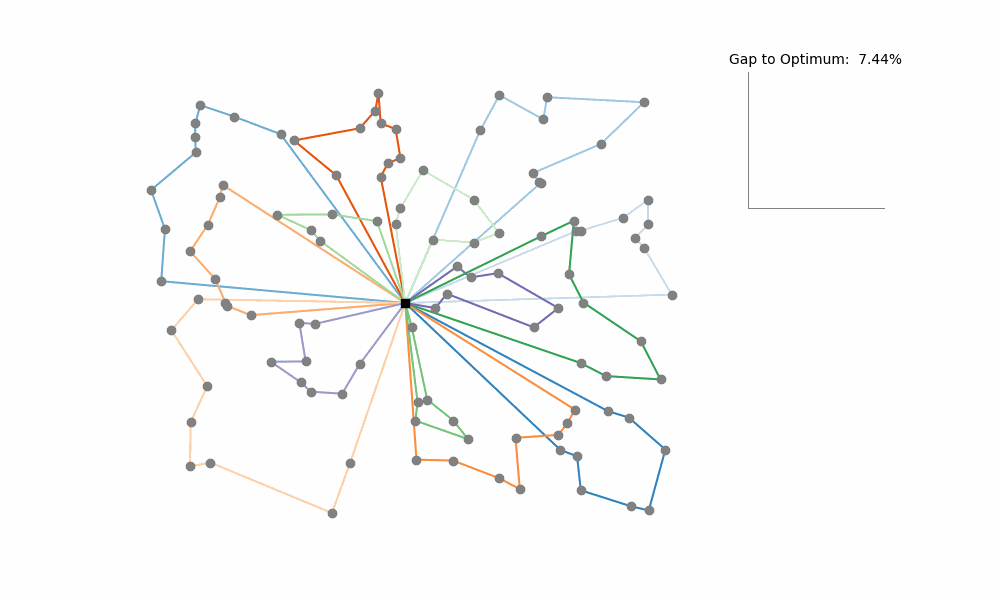

# Guided Local Search for Vehicle Routing Problems

This repository contains the Java implementation of the [Knowledge Guided Local Search](https://www.sciencedirect.com/science/article/abs/pii/S0305054819300024) (KGLS)
and its extension to [very large instances](https://www.sciencedirect.com/science/article/abs/pii/S0305054819300668)

KGLS (a variation of Guided Local Search) is a powerful heuristic for solving the Vehicle Routing Problem (VRP) and its variants.
The algorithm iteratively searches for small, improving changes to the current solution (local search moves). 
When no further improvements can be made, KGLS penalizes unfavorable edges 
(as determined by domain-specific knowledge) 
to escape local optima and explore new parts of the solution space.



---

# Getting Started

The compiled algorithm can be run with, for example

```bash
java -cp bin Main large_instances/antwerp1.vrp 100
```

The first parameter is the path to the instance file, and the second parameter the maximal runtime in seconds.
Also, all parameters of KGLS (see below) can be customized by passing them as key-value pairs, e.g.

```bash
java -cp bin Main large_instances/antwerp1.vrp 100 depth_lin_kernighan=6 num_perturbations=20
```

All results and stats will be written to a log file.

## Input Format
KGLS accepts VRP instance files as input. Example files are available in the `examples` directory 
or on the [VRP website](http://vrp.galgos.inf.puc-rio.br/index.php/en/).


## Parameters
The following parameters can be adapted.

| Parameter          | Description                                                                                                                         | Default Value                                          |
|--------------------|-------------------------------------------------------------------------------------------------------------------------------------|--------------------------------------------------------|
| `moves`           | The local search moves to use (in the given order).<br/> Currently implemented are: `segment_move`, `cross_exchange` and `relocation_chain` | [`segment_move`, `cross_exchange`, `relocation_chain`] |
| `neighborhood_size`       | The number of nearest neighbors to which a node can be connected.                                                                   | 20                                                     |
| `num_perturbations`       | The number of moves which have to be executed with penalized costs during the perturbation phase.                                   | 3                                                      |
| `depth_lin_kernighan`     | The maximum number of edge exchanges in the lin-kernighan heuristic.                                                                | 5                                                      |
| `depth_relocation_chain`  | The maximum number of relocation moves which can be executed in a relocation chain.                                                 | 3                                                      |


## Implemented local search moves

KGLS employs four local search heuristics to iteratively improve the solution.

1. **Segment Relocation**
    Moves a segment of nodes (i.e., either a single or multiple connected nodes) from one route to another. Note: In the original paper Segment Relocations are contained in CROSS Exchange.

2. **CROSS Exchange**
    Exchanges segments between two routes.

3. **Relocation Chain**
    Performs a series of relocation moves (i.e., moving one node to another route), such that the resulting solution remains feasible.

4. **Lin-Kernighan Heuristic**
    A powerful and flexible edge exchange heuristic originally designed for the Travelling Salesman Problem. KGLS uses a simplified implementation to improve routes in themselves.

---

## Contributions
Contributions to this repository are welcome! 
If you have ideas for new features, optimizations, or extensions, feel free to open an issue or submit a pull request.

---

## References
[Original KGLS Paper](https://www.sciencedirect.com/science/article/abs/pii/S0305054819300024)

[VRP Repository](http://vrp.galgos.inf.puc-rio.br/index.php/en/)

---

## License
This project is licensed under the MIT License. See the LICENSE file for details.

